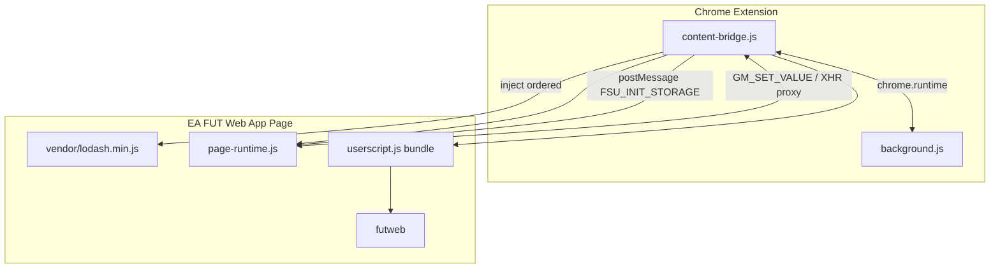
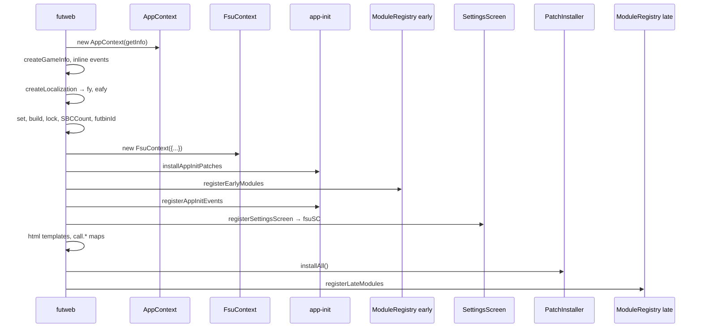
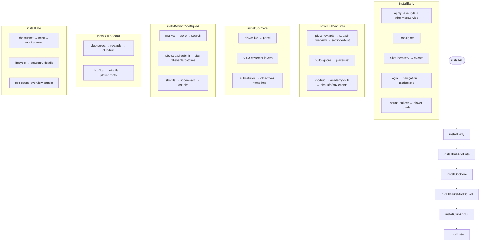

# ARCHITECTURE.md — FSU FUT Enhancer

## 目錄

1. [系統總覽](#系統總覽)
2. [啟動順序](#啟動順序)
3. [模組邊界](#模組邊界)
4. [依賴與 FsuContext](#依賴與-fsucontext)
5. [Patch 安裝順序](#patch-安裝順序)
6. [events.* API 索引](#events-api-索引)
7. [模組化踩坑](#模組化踩坑)

---

## 系統總覽

FSU 分三層執行：

| 層 | 執行環境 | 職責 |
|----|----------|------|
| Content script | 擴充隔離世界 | 注入腳本、轉發 storage / fetch 到 background |
| Page runtime | EA 頁面世界 | `GM_getValue` / `GM_xmlhttpRequest` 等 shim |
| FSU 模組 | EA 頁面世界 | 業務邏輯 + EA prototype patches |



---

## 啟動順序

### 1. 擴充注入（content-bridge）

腳本順序（**順序敏感**）：

1. `vendor/lodash.min.js`
2. `src/page-runtime.js` — 注入後等待 `FSU_REQUEST_INIT` handshake
3. `postMessage(FSU_INIT_STORAGE)` — 同步 storage 到 page world
4. `src/userscript.js` — bundled IIFE

`page-runtime` 必須在 `userscript` 之前就緒，否則 `GM_*` 未定義。

### 2. Userscript 入口（`fsu/index.js`）

```js
FsuUserscriptApp.run()
  → expose lodash to unsafeWindow._
  → if URL contains "ultimate-team/web-app" → futweb()
```

### 3. futweb() 編排（`legacy/futweb.js`）



| 步驟 | 說明 |
|------|------|
| `createGameInfo()` | 靜態 `info` 初始狀態（需 EA 全域 `PlayerAttribute` 等） |
| `AppContext` | store, httpClient, priceService, settings/build/lock/sbcCount |
| 內聯 `events` | `showLoader`, `hideLoader`, `taskHtml`, `countPlayerAccele` |
| `FsuContext` | 統一 deps；`ctx` 欄位為 `AppContext` 實例 |
| `installAppInitPatches` | **早於** PatchInstaller 的 EA 登入/樣式 hook |
| `registerEarlyModules` | UI factory、`getItemBy`、requirements 文字 |
| `registerSettingsScreen` | 設定頁；產出 `fsuSC` 寫回 `fsuCtx.fsuSC` |
| `call` / `html` | 保存 EA prototype 原始方法，供 patch 呼叫鏈使用 |
| `PatchInstaller.installAll` | 主要 EA hook 批次（見下節） |
| `registerLateModules` | 市場、開包、AutoBuy、學院、FG 評分、詳情按鈕 |

---

## 模組邊界

```
extension/src/fsu/
├── core/
│   ├── AppContext.js      # 基礎服務組裝（store, price, settings…）
│   ├── FsuContext.js      # futweb 執行期 deps 容器 + pick()
│   ├── PatchInstaller.js  # 依 legacy 順序安裝 patches
│   ├── ModuleRegistry.js  # registerEarly/LateModules
│   ├── DomainHelpers.js   # market/pack/autoBuy 等 helper 工廠
│   ├── PatchRegistry.js   # call.view 原始方法對照
│   └── TtlCache.js / PriceRequestQueue.js / …
├── domain/                # 可測試業務邏輯，透過 helpers 取 deps
├── patches/               # EA prototype 修改 + events 註冊
├── legacy/futweb.js       # 僅編排，不堆業務
├── ui/                    # DOM 工廠、設定畫面、CSS
├── data/                  # localization, game-config
└── infra/                 # HttpClient, JsonStore
```

### patches vs domain

| | patches/ | domain/ |
|---|----------|---------|
| 依賴 EA 類別 | 是（`UT*` prototype） | 否 |
| 對外 API | 掛到 `events.*` | `createFacade` / 純函式 |
| 測試 | 多為整合 / 手動 | 單元測試友好 |
| deps 傳入 | **必須** | 透過 helpers 物件 |

### call 物件

`call` 保存被覆寫前的 EA 方法，結構：

- `call.view.*` — View / ViewController render 鏈
- `call.plist.*` — 列表元件
- `call.selectClub.*` — 俱樂部選人
- `call.other.*` — store, market, rewards, picks…
- `call.task.*` — SBC / objectives hub
- `call.search.*` / `call.squad.*` / `call.panel.*`

Patch 內典型模式：

```js
SomeEAClass.prototype.someMethod = function (...args) {
  events.doSomething(this, ...args);
  return call.view.card.call(this, ...args);
};
```

---

## 依賴與 FsuContext

`FsuContext` 取代舊 `patchCtx`：

```js
const fsuCtx = new FsuContext({ events, info, call, ctx, fy, ... });
installXxx(fsuCtx.pick("events", "fy", "call"));
```

常用欄位：

| 欄位 | 用途 |
|------|------|
| `events` | 執行期 API facade |
| `info` | 全域狀態（設定、價格快取、SBC 資料） |
| `call` | EA 原始 prototype 備份 |
| `ctx` | **AppContext**（`priceService`, `sbcCountService`…） |
| `cntlr` | `ControllerAccess` — 目前/左側 EA controller |
| `fy` / `eafy` | 本地化 |
| `repositories` / `services` | EA 內建 repository / service |
| `set` / `build` / `lock` / `SBCCount` | 設定 facade |
| `fsuSC` | 設定畫面 controller（較晚才有） |
| `GM_*` | userscript API（由 page-runtime 提供） |

`to*Deps()` 方法避免手寫重複 pick 列表。

---

## Patch 安裝順序

`PatchInstaller.installAll()` 分 **6 個 phase**，順序與舊版 monolith 一致，**不要隨意重排**。



### Phase 明細表

#### installEarly

| # | 函式 | 主要 deps |
|---|------|-----------|
| 0 | `wirePriceService` | events, priceService |
| 1 | `installUnassignedPatches` | call, events, fy, cntlr, info, debug |
| 2 | SbcChemistry `createEventsFacade` | repositories.TeamConfig |
| 3 | `installLoginPatches` | call, events, info, services, GM_* |
| 4 | `installNavigationPatches` | call, events, info, isPhone, SBCCount |
| 5 | `installTacticsRolePatch` | call |
| 6 | `installSquadBuilderPatches` | call, events, fy, info, build |
| 7 | `installPlayerCardPatches` | call, events, fy, cntlr, info, lock |

#### installHubAndLists

`picks-rewards` → `squad-overview-view` → `sectioned-list` → `build-ignore` → `player-list` (events+patch) → `sbc-hub` → `academy-hub` → `sbcInfoFill` → `sbcNavEvents`

#### installSbcCore

`player-bio` → `panel` → `SBCSetMeetsPlayers` → `sbc-substitution` → `objectives-hub` → `home-hub`

#### installMarketAndSquad

`market` → `store` → `search` (patch+events) → `sbc-squad-submit` → `sbc-fill` (events+patch) → `sbc-tile` → `sbc-reward` → `fast-sbc`

#### installClubAndUi

`club-select` (patch+events) → `club-select-search` → `rewards` → `club-hub` → `list-filter` → `ui-utils` → `localization` → `player-meta`

#### installLate

`sbc-submit` → `misc` → `sbc-requirements` → `lifecycle` → `academy-details` → `sbc-squad-overview`

> **注意**：`installAppInitPatches` 在 `futweb` 裡、於 `PatchInstaller` **之前**單獨呼叫，不屬於上表 phase。

---

## events.* API 索引

`events` 是單例 facade：各模組用 `events.foo = …` 或 `Object.assign(events, facade)` 註冊。  
以下按**功能域**分類；「來源」為首次賦值的檔案。

### 核心 / UI

| API | 說明 | 來源 |
|-----|------|------|
| `showLoader` / `hideLoader` | 全屏 loading | `legacy/futweb.js` |
| `changeLoadingText` | 更新 loading 文案 | `patches/player-list.js` |
| `wait` | 隨機延遲 | `patches/player-list.js` |
| `notice` | Toast 通知 | `patches/app-init.js` |
| `init` | FSU 初始化入口 | `patches/app-init.js` |
| `addLoadingElment` | 注入 loading DOM | `patches/app-init.js` |
| `enhanceStyleChange` | 樣式增強 | `patches/app-init.js` |
| `createButton` / `createToggle` / `createTile` | UI 元件 | `ui/UiFactory.js` |
| `createElementWithConfig` / `createDF` | DOM 建構 | `ui/UiFactory.js` |
| `popup` | 彈窗 | `ui/UiFactory.js` |
| `taskHtml` | 任務 HTML | `legacy/futweb.js` |
| `countPlayerAccele` | 加速類型計算 | `legacy/futweb.js` |

### 價格 / HTTP

| API | 說明 | 來源 |
|-----|------|------|
| `getFutbinUrl` / `getPriceForUrl` / `getPriceForFubin` | Futbin 價格 | `core/PatchInstaller.js` |
| `getCachePrice` / `priceLastDiff` | 快取價格 / 價差顯示 | `core/PatchInstaller.js` |
| `externalRequest` | HTTP 代理 | `core/PatchInstaller.js` |

### 球員搜尋 / 清單

| API | 說明 | 來源 |
|-----|------|------|
| `getItemBy` | 俱樂部/倉庫搜尋 | `core/ModuleRegistry.js` |
| `invalidatePlayerSearchCache` | 清除搜尋快取 | `core/ModuleRegistry.js` |
| `isPrecious` | 是否保留高價球員 | `core/ModuleRegistry.js` |
| `loadPlayerInfo` / `getGGRating` / `getPlayerGGR` | 球員資訊 / GG 評分 | `patches/player-list.js` |
| `playerSelectionSort` | 選人排序 | `patches/navigation.js` |
| `listSortFilter` / `fsuDispose` | 清單排序 / 清理 | `patches/lifecycle-patches.js` |
| `setListFilterTitleAndState` / `listFilterData` | 篩選 UI | `patches/club-select-events.js` |
| `normalizePositions` | 位置正規化 | `patches/lifecycle-patches.js` |

### 市場 / 轉會

| API | 說明 | 來源 |
|-----|------|------|
| `getAuction` / `buyPlayer` / `buyConceptPlayer` | 購買 | `core/ModuleRegistry.js` |
| `readAuctionPrices` / `searchTransferMarket` | 讀價 / 搜市場 | `core/ModuleRegistry.js` |
| `transferToClub` / `playerToAuction` | 送俱樂部 / 上架 | `core/ModuleRegistry.js` |
| `losAuctionSell` / `losAuctionCount` | 低價出售 | `core/ModuleRegistry.js` |
| `playerGetLimits` | 球員限制 | `patches/sbc-fill-patches.js` |
| `cardAddBuyErrorTips` / `getCardTipsHtml` | 購買錯誤提示 | `patches/sbc-fill-events.js` |
| `conceptBuyBack` | 概念買回 | `patches/panel-patches.js` |

### 開包 / 商店

| API | 說明 | 來源 |
|-----|------|------|
| `tryPack` / `tryPackPopup` / `getTryPackData` | 試開包 | `core/ModuleRegistry.js` |
| `raelProbability` / `getRealProbability` | 機率 | `core/ModuleRegistry.js` |
| `openPacks` / `openPacksConfirmPopup` / `openPacksResultPopup` | 開包流程 | `core/ModuleRegistry.js` |
| `writePackReturns` | 記錄開包結果 | `core/ModuleRegistry.js` |
| `truncateStrict` / `goToInPacks` | 商店 UI | `patches/store.js` |
| `setPackTileText` | 包 tile 文案 | `patches/sbc-tile-events.js` |

### SBC — 化學 / 評分 / 資料

| API | 說明 | 來源 |
|-----|------|------|
| `calculateChemistry` / `getChemistryPlayers` | 化學計算 | `domain/SbcChemistryService.js` |
| `getChemistryPointsByThreshold` / `generateCandidateOptions` | 化學輔助 | 同上 |
| `requirementsToText` | 條件翻譯 | `core/ModuleRegistry.js` |
| `teamRatingCount` / `needRatingsCount` / `sbcListNeedCount` | 評分需求 | `domain/SbcRatingService.js` |
| `getFutbinSbcSquad` / `createVirtualChallenge` | Futbin 陣容 | `domain/SbcDataService.js` |
| `saveOldSquad` / `getRatingPlayers` / `getFastSbcSubText` | 陣容資料 | 同上 |
| `SBCSetMeetsPlayers` | 符合條件球員 | `core/PatchInstaller.js` |
| `SBCDisplayPlayers` | 替補顯示 | `patches/sbc-substitution.js` |

### SBC — UI / 流程

| API | 說明 | 來源 |
|-----|------|------|
| `sbcFilter` / `sbcInfoFill` / `navigationAddCount` | Hub UI | `patches/sbc-hub.js` |
| `squadCount` / `getDedupPlayers` / `getOddo` | 導航 | `patches/sbc-nav-events.js` |
| `openFutbinPlayerUrl` | 開 Futbin | `patches/sbc-nav-events.js` |
| `sbcSubPrice` / `changeHeaderSBCEntrance` | 送隊 / 入口 | `patches/sbc-squad.js` |
| `fastSBC` / `isSBCCache` / `fastSBCQuantity` | 快速 SBC | `patches/sbc-fast.js`, `sbc-fill-events.js` |
| `playerListFillSquad` / `getTemplate` / `saveSquad` | 自動填隊 | `patches/sbc-fill-events.js` |
| `isEligibleForOneFill` / `oneFillCreationGF` | One-fill | `sbc-fill-events.js`, `sbc-reward-events.js` |
| `goToSBC` / `SBCListInsertToFront` / `setSbcTileText` | Tile | `patches/sbc-tile-events.js` |
| `getIgnoreText` | 忽略文字 | `patches/sbc-squad-overview.js` |
| `ignorePlayerToCriteria` / `ignorePlayerPopup` | 忽略球員 | `patches/build-ignore.js` |
| `sendPinEvents` | Pin 事件 | `patches/sbc-fill-events.js` |

### 搜尋 / 填隊

| API | 說明 | 來源 |
|-----|------|------|
| `searchFill` / `searchInput` / `searchInputEvent` | 搜尋框 | `patches/search-events.js` |
| `playerSearchCountShow` | 搜尋計數 | `patches/search-events.js` |
| `squadPositionSelection` | 位置選擇 | `patches/lifecycle-patches.js` |

### 學院 / 進化 / FG 評分

| API | 說明 | 來源 |
|-----|------|------|
| `academyAddAttr` / `academyPreviewEvolutionAttr` / … | 學院計算 | `domain/AcademyCalcService.js` |
| `fgCalc` / `fgPopup` / `fgCreateElment` / … | FG 評分 | `domain/FgRatingService.js` |
| `getAcceleRate` / `accelePopup` / `getBoostedAttribute` | 加速風格 | `patches/club-select-events.js` |

### AutoBuy（`Object.assign` 批次註冊）

`goToAutoBuy`, `autoBuySearchPlayer`, `autoBuyRightRefresh`, `autoBuyCreateInfoView`, `autoBuyCreateLogView`, `autoBuyRightRenderInfo`, `autoBuyRightMinBuyChanged`, `autoBuyRightMaxBuyChanged`, `autoBuyRightRenderLog`, `autoBuyCreateItemController` — 來源 `domain/AutoBuyService.js`

### 導航 / Hub / 雜項

| API | 說明 | 來源 |
|-----|------|------|
| `reloadPlayers` | 重載球員 | `patches/home-hub.js` |
| `goToStoragePlayers` / `goToLockPlayers` | 倉庫 / 鎖定 | `patches/club-hub.js` |
| `goToUnassigned` | 未分配 | `patches/misc-patches.js` |
| `jsonToItemEntity` | JSON → Item | `patches/misc-patches.js` |
| `getDB` / `saveImageToIndexedDB` / `getImageByName` | IndexedDB | `patches/misc-patches.js` |
| `getPlayerMetaToText` / `getPlayerMetaPopupText` | Meta 顯示 | `patches/player-meta.js` |
| `detailsButtonSet` | 球員詳情按鈕 | `core/ModuleRegistry.js` |
| `waitForClickShieldToHide` | 等待遮罩 | `patches/club-select-events.js` |
| `showRewardsView` / `getCurrent` | 獎勵視圖 | `patches/sbc-reward-events.js` |
| `setRewardOddo` | 獎勵機率 | `patches/rewards.js` |
| `fixedPickPopup` | Pick 修正 | `patches/misc-patches.js` |
| `noticeSpecialPlayerInfo` | 特殊球員提示 | `patches/lifecycle-patches.js` |

---

## 模組化踩坑

### 1. `xxx is not defined`（最常見）

**原因**：patch 檔從 futweb 閉包抽出後，仍直接使用 `call` / `fy` / `services` 等變數，但沒透過 `deps` 傳入。

**修法**：

```js
// ❌
export function registerFooEvents() {
  events.bar = () => fy("key");
}

// ✅
export function registerFooEvents(deps) {
  const { events, fy } = deps;
  events.bar = () => fy("key");
}
```

並在 `PatchInstaller` 加上 `c.pick(..., "fy")`。

### 2. `ctx` 雙層命名

- `PatchInstaller` 的 `this.ctx` = **FsuContext**
- `FsuContext.ctx` = **AppContext**

因此 `c.ctx.sbcCountService` 是正確寫法，不是 `c.sbcCountService`。

### 3. 安裝順序依賴

| 依賴 | 必須晚於 |
|------|----------|
| `events.createButton` | `registerEarlyModules`（UiFactory） |
| `events.getItemBy` | `registerEarlyModules` |
| `events.calculateChemistry` | `installEarly`（SbcChemistry） |
| `fsuCtx.fsuSC` | `registerSettingsScreen` |
| `registerLateModules` 的 market/pack | `events.notice`, `events.createButton` 等 |

`registerLateModules` 刻意放在 `PatchInstaller` **之後**，因為多數 patch 會在執行期才呼叫這些 API。

### 4. 不要手改 bundle

改 `extension/src/fsu/**` → `npm run build` → 產出 `userscript.js`。  
CI / `test:all` 會驗 bundle 含關鍵符號。

### 5. EA 全域僅存在於 FUT 頁面

`UT*`, `PlayerAttribute`, `ItemSubAttribute`, `services`, `repositories` 由 EA 提供。  
`createGameInfo()` 必須在 `futweb()` 內呼叫，不能在建置時於 Node 執行。

### 6. GM_* 與測試

`DomainHelpers` 使用 `ctx.GM_xmlhttpRequest`，不要假設測試環境有 `GM_xmlhttpRequest` 全域。

### 7. Extension context invalidated

擴充重新載入後，content script 失效。使用者需 **重新整理 FUT 分頁**（content-bridge 會 `warnOnce`）。

### 8. Patch phase 順序

`PatchInstaller` 的 6 個 phase 對應舊腳本 hook 順序。調整順序可能導致 EA 內部狀態不一致或 UI 閃爍，除非有明確理由否則保持不變。

### 9. 重複註冊 events

`club-select-events.js` 與 `ui-utils.js` 都定義 `getAcceleRate` 等。後載入者覆蓋前者；新增功能時確認載入順序（見 `installClubAndUi`）。

---

## 相關文件

- [AGENTS.md](./AGENTS.md) — AI 精簡導覽
- `extension/tests/` — 測試與 manifest 驗證
- `.github/workflows/test.yml` — CI