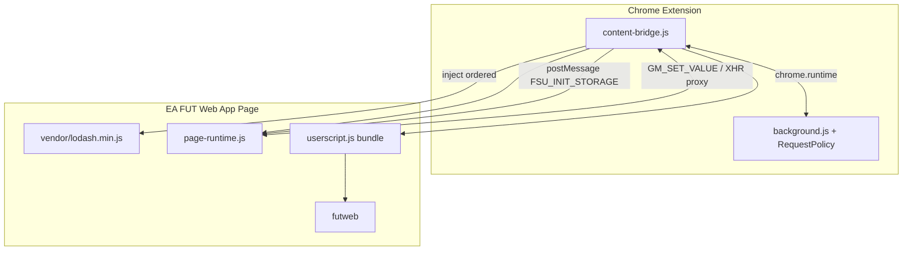
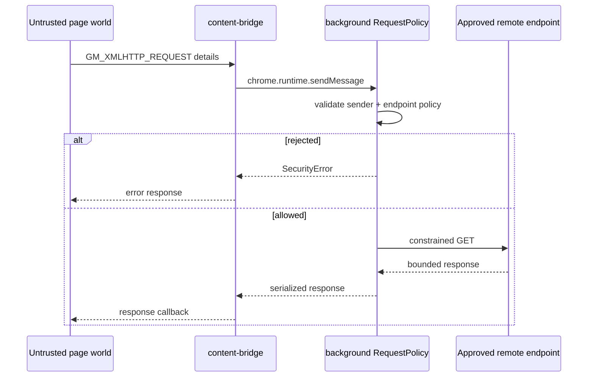
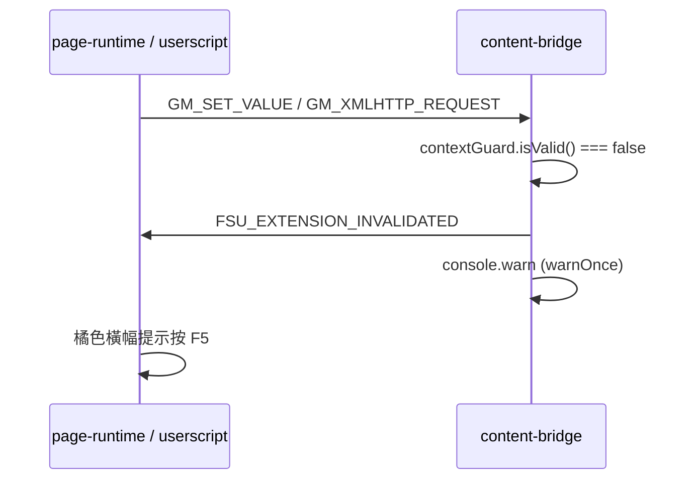
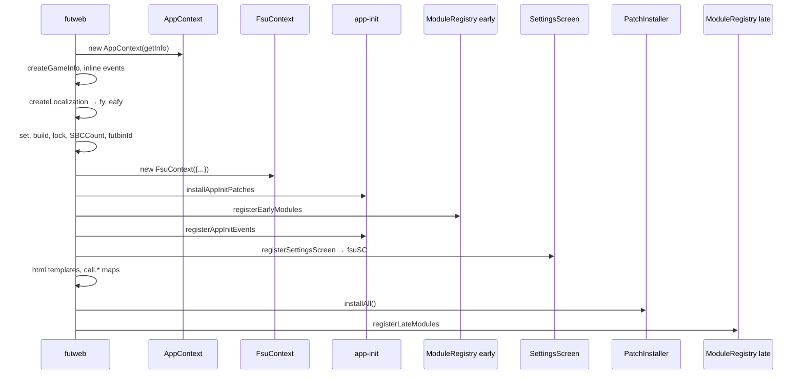
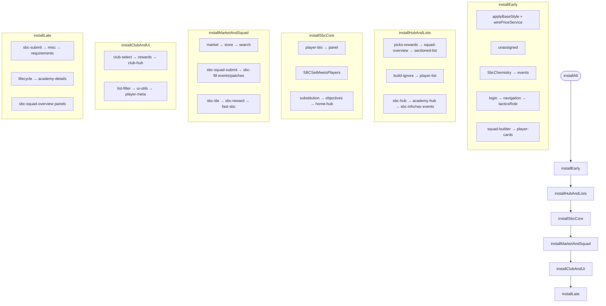

# ARCHITECTURE.md — FSU FUT Enhancer

## 目錄

1. [系統總覽](#系統總覽)
2. [Extension 安全邊界](#extension-安全邊界)
3. [啟動順序](#啟動順序)
4. [模組邊界](#模組邊界)
5. [型別策略](#型別策略)
6. [依賴與 FsuContext](#依賴與-fsucontext)
7. [Patch 安裝順序](#patch-安裝順序)
8. [events.* API 索引](#events-api-索引)
9. [模組化踩坑](#模組化踩坑)

---

## 系統總覽

FSU 分三層執行：

| 層 | 執行環境 | 職責 |
|----|----------|------|
| Content script | 擴充隔離世界 | 注入 packaged scripts、轉發 storage、將 page request 送往 background 驗證 |
| Page runtime | EA 頁面世界 | `GM_getValue` / `GM_xmlhttpRequest` 等 shim |
| FSU 模組 | EA 頁面世界 | 業務邏輯 + EA prototype patches |


```mermaid
flowchart TB
  subgraph ext [Chrome Extension]
    BG[background.js + RequestPolicy]
    CB[content-bridge.js]
  end

  subgraph page [EA FUT Web App Page]
    LODASH[vendor/lodash.min.js]
    PR[page-runtime.js]
    US[userscript.js bundle]
    FW[futweb]
  end

  CB -->|inject ordered| LODASH
  CB --> PR
  CB -->|postMessage FSU_INIT_STORAGE| PR
  CB --> US
  US --> FW
  PR <-->|GM_SET_VALUE / XHR proxy| CB
  CB <-->|chrome.runtime| BG
```

---

## Extension 安全邊界

FSU 的 page runtime 必須存取 EA page world，因此 `window.postMessage` 的訊息可能被同頁其他 script 偽造。`source: "fsu-extension-page"` 是 routing marker，不是身份驗證。

安全模型採雙層限制：

1. `manifest.json` 只在 FUT Web App 注入 content script，並限制 extension 可連線的 host。
2. `background.js` 的 `SenderPolicy` 和 `RequestPolicy` 再驗證 sender URL、request origin、path、method、headers 和 credentials。


```mermaid
sequenceDiagram
  participant P as Untrusted page world
  participant C as content-bridge
  participant B as background RequestPolicy
  participant R as Approved remote endpoint

  P->>C: GM_XMLHTTP_REQUEST details
  C->>B: chrome.runtime.sendMessage
  B->>B: validate sender + endpoint policy
  alt rejected
    B-->>C: SecurityError
    C-->>P: error response
  else allowed
    B->>R: constrained GET
    R-->>B: bounded response
    B-->>C: serialized response
    C-->>P: response callback
  end
```

目前 policy 的不變條件：

- 只允許 HTTPS 和已列出的 endpoint path。
- 現有遠端整合只允許 GET。
- header 依 endpoint allowlist 過濾；EA market 才能轉發 `X-UT-SID`。
- credentials 預設 omit；需要 cookie 的 endpoint 必須明確宣告。
- redirect 採 fail closed，timeout 上限 30 秒，response 上限 5 MiB。
- Lodash 和 userscript 皆來自 extension package，不使用 CDN fallback。

HTML 是另一個信任邊界。`createTrustedMarkup()` 產生 extension-owned brand；`setTrustedHtml()` / `createDF()` 只接受 branded markup，不接受任意 string。`createElementWithConfig()` 禁止 `innerHTML`／`on*` 等 sink。遠端與 localization 值必須走 `textContent`／text nodes，或先 `escapeHtml` 再組裝 brand。完整維護規則見 [SECURITY.md](SECURITY.md)。

---

## 啟動順序

### 1. 擴充注入（content-bridge）

腳本順序（**順序敏感**）：

1. `vendor/lodash.min.js`
2. `src/page-runtime.js` — 注入後等待 `FSU_REQUEST_INIT` handshake
3. `postMessage(FSU_INIT_STORAGE)` — 同步 storage 到 page world
4. `src/userscript.js` — bundled IIFE

`page-runtime` 必須在 `userscript` 之前就緒，否則 `GM_*` 未定義。

### 1b. 擴充重載後的失效處理

在 `chrome://extensions` 重新載入 FSU 後，**已開啟的 FUT 分頁**仍跑舊 page script，但 content script 的 `chrome.runtime` 已失效。


```mermaid
sequenceDiagram
  participant Page as page-runtime / userscript
  participant CB as content-bridge
  Page->>CB: GM_SET_VALUE / GM_XMLHTTP_REQUEST
  CB->>CB: contextGuard.isValid() === false
  CB->>Page: FSU_EXTENSION_INVALIDATED
  CB->>CB: console.warn (warnOnce)
  Page->>Page: 橘色橫幅提示按 F5
```

使用者需 **F5** 讓 `content-bridge.boot()` 重新注入整套腳本。這是預期行為，不是 FSU 邏輯 bug。

### 1c. MV3 Browser Smoke

`extension/tests/browser-smoke.mjs` 以 Playwright persistent context 載入真實
manifest、background、content bridge 與 page runtime。測試頁只建立 sanitized
`UTMarketSearchView`、`UTStoreView` 與 `UTPackAnimationViewController` shell；
test-only userscript bundle 直接使用
production `PatchLifecycleRegistry`、`market.search-view-generate`、
`store.pack-list`、`store.pack-open-transaction` 與
`store.pack-animation` descriptor，驗證 install、
duplicate、disable、reinstall、exact restore 及 diagnostics allowlist。

fixture 不包含 EA 帳號、Cookie、session 或 `X-UT-SID`。browser smoke 同時保留
storage handshake、偽造 request rejection 與 extension reload invalidation 測試。

### 2. Userscript 入口（`fsu/index.js`）

```js
FsuUserscriptApp.run()
  → expose lodash to unsafeWindow._
  → if URL contains "ultimate-team/web-app" → futweb()
```

### 3. futweb() 編排（`legacy/futweb.js`）


```mermaid
sequenceDiagram
  participant FW as futweb
  participant AC as AppContext
  participant FC as FsuContext
  participant AI as app-init
  participant EM as ModuleRegistry early
  participant SS as SettingsScreen
  participant PI as PatchInstaller
  participant LM as ModuleRegistry late

  FW->>AC: new AppContext(getInfo)
  FW->>FW: createGameInfo, inline events
  FW->>FW: createLocalization → fy, eafy
  FW->>FW: set, build, lock, SBCCount, futbinId
  FW->>FC: new FsuContext({...})
  FW->>AI: installAppInitPatches
  FW->>EM: registerEarlyModules
  FW->>AI: registerAppInitEvents
  FW->>SS: registerSettingsScreen → fsuSC
  FW->>FW: html templates, call.* maps
  FW->>PI: installAll()
  FW->>LM: registerLateModules
```

| 步驟 | 說明 |
|------|------|
| `createGameInfo()` | 靜態 `info` 初始狀態（需 EA 全域 `PlayerAttribute` 等） |
| `AppContext` | store, httpClient, priceService, settings/build/lock/sbcCount |
| 內聯 `events` | `showLoader`, `hideLoader`, `taskHtml`, `countPlayerAccele` |
| `FsuContext` | 統一 deps；`ctx` 欄位為 `AppContext` 實例 |
| `installAppInitPatches` | **早於** PatchInstaller 的 EA 登入/樣式 hook |
| `registerEarlyModules` | UI factory、`getItemBy`、requirements 文字 |
| `registerSettingsScreen` | 設定頁；產出 `fsuSC` 寫回 `fsuCtx.fsuSC` |
| `call` / `html` | 保存 EA prototype 原始方法，供 patch 呼叫鏈使用 |
| `PatchInstaller.installAll` | 主要 EA hook 批次（見下節） |
| `registerLateModules` | SBC 資料/評分、市場操作、學院、FG 評分、詳情按鈕 |

---

## 模組邊界

```
extension/src/fsu/
├── core/
│   ├── AppContext.js      # 基礎服務組裝（store, price, settings…）
│   ├── FsuContext.js      # futweb 執行期 deps 容器 + pick()
│   ├── PatchInstaller.js  # 依 legacy 順序安裝 patches
│   ├── ModuleRegistry.js  # registerEarly/LateModules
│   ├── DomainHelpers.js   # market/academy/FG/player-search helper 工廠
│   ├── PatchRegistry.js   # call.view 原始方法對照
│   ├── PatchLifecycleRegistry.js # descriptor install/verify/restore migration kernel
│   └── TtlCache.js / PriceRequestQueue.js / …
├── domain/                # 業務邏輯；部分模組仍含待遷移的 page/EA runtime 依賴
├── ea/                    # EA runtime capability adapters 與 diagnostics
├── patches/               # EA prototype 修改 + events 註冊
├── legacy/futweb.js       # 僅編排，不堆業務
├── ui/                    # DOM 工廠、設定畫面、CSS
├── data/                  # localization, game-config
└── infra/                 # HttpClient, JsonStore
```

### patches vs domain

| | patches/ | domain/ |
|---|----------|---------|
| 依賴 EA 類別 | 是（`UT*` prototype） | 部分仍直接依賴；屬遷移債務 |
| 對外 API | 掛到 `events.*` | `createFacade`、具名 service 或純函式 |
| 測試 | 目前多為 bundle check / 手動 | 純模組有單元測試；runtime-coupled 模組較少 |
| deps 傳入 | **必須** | 目標為 helpers/adapter；現況仍有 ambient globals |

`domain/` 是目標邊界，不代表其中所有檔案已經純化。現況分類、patch phase
與 EA capability 對照見 [MIGRATION_INVENTORY.md](MIGRATION_INVENTORY.md)。

### call 物件

`call` 保存被覆寫前的 EA 方法，結構：

- `call.view.*` — View / ViewController render 鏈
- `call.plist.*` — 列表元件
- `call.selectClub.*` — 俱樂部選人
- `call.other.*` — store, market, rewards, picks…
- `call.task.*` — SBC / objectives hub
- `call.search.*` / `call.squad.*` / `call.panel.*`

Patch 內典型模式：

```js
SomeEAClass.prototype.someMethod = function (...args) {
  events.doSomething(this, ...args);
  return call.view.card.call(this, ...args);
};
```

### Patch lifecycle migration kernel

`PatchRegistry` 目前仍負責建立 legacy `call.*` 原方法對照。
`PatchLifecycleRegistry` 是獨立的遷移 kernel，提供：

- 唯一 descriptor ID 與 phase diagnostics
- target resolution、verify、duplicate install 防護
- apply failure 時恢復原 property descriptor
- reverse-order `restoreAll()` 與 optional restore hook
- 只包含 member identifier 的 sanitized diagnostics

目前 production descriptors 為 `home.academy-tile`、
`market.search-view-generate`、`price.squad-value`、
`details.quick-list-render`、`sbc.challenges-view`、
`sbc.submit-transaction`、`store.pack-list` 與
`store.pack-open-transaction`、`store.reveal-list`、
`store.pack-animation`、`store.category-navigation` 與
`store.hub-tiles`。它們保留原安裝位置與精確
restore；支援 UI toggle 的 descriptor 可獨立 disable/reinstall，其餘 patch
仍走直接 prototype assignment。`PatchInstaller` 的 6 個 phase 仍是正式相容路徑。

`store.pack-list` 呼叫原 `UTStoreView.setPacks` 前，先由
`StorePackCatalogAdapter` 將 EA article 轉成 validated snapshot，再由純
`StorePackCatalogService` 執行 my-packs 去重、排序與 summary 建構。單一 article
shape/getter/localization 失敗只產生 sanitized warning；原 article 仍傳給 EA
renderer，不會因 FSU enhancement 失敗而清空商店。

`store.pack-open-transaction` 以 validated pack selection、EA
`isOpeningPack` 與 my-packs inventory 下降作為完成證據。只有 inventory-confirmed
success 才更新 `info.douagain.pack`；duplicate 不呼叫 EA，rejection 釋放鎖，
timeout 或 inventory capability drift 保持 fail-closed。無法建立 selection
contract 時仍呼叫 EA 原方法，但不提交 FSU state。

包內球員查詢由 `InPacksSearchAdapter` 建立 `UTSearchCriteriaDTO` 並透過 bounded
`EaObservableAdapter` 讀取每頁，`InPacksSearchService` 負責 cancellation token、
200 筆 page size、10 頁上限、100ms 頁間延遲與 partial failure result。新查詢或
navigation drift 使舊 operation 失效；只有完整成功後才依 configured definition
ID 順序一次替換 `info.inpacks.players`。

Store UI lifecycle family 各自提供 feature toggle。Reveal、category 與 hub
wrapper 保留 EA 原方法回傳值，並隔離 FSU 排序、badge、player info 或 tile
augmentation 失敗；pack animation capability drift 會以零延遲 callback 收尾，
避免 controller 停在 running 狀態。所有 diagnostics 只包含固定 feature label。

---

## 型別策略

專案仍以 JavaScript ES modules 為主，透過 TypeScript `checkJs` 漸進建立 strict island。`tsconfig.json` 只列出已完成契約整理的純模組，並啟用 `strict`、`noImplicitReturns` 和 `noUncheckedIndexedAccess`。

目前策略：

- 純 `core/`、`infra/`、`domain/` 和 UI safety helper 優先加入 typecheck。
- 使用 JSDoc generic、record 和 capability shape 描述現有 JavaScript API。
- 直接依賴 EA 動態全域的 patch 暫不強制轉 `.ts`；先透過 adapter／declaration 縮小邊界。
- `npm run test:all` 固定執行 build、typecheck 和 tests，避免型別設定只存在於編輯器。

目前 `EaRuntimeAdapter` 已是 strict island 的一部分。`EaMarketSearchSession` 隱藏 EA search DTO/view model 的欄位同步，domain 市場唯讀流程只使用 capability、session 和結構化 failure result。寫入邊界目前正規化「移動物品到俱樂部」、單一及批量球員購買交易、物品上架與未分配清單重置；adapter 也封裝靜態球員資料、購買容量與上架庫存查詢。購買與上架都會等待 EA observable 結束，再把結果交回 domain 映射既有 UI 或 EA 通知。獨立競標與其他市場寫入操作尚未完成 adapter 遷移。

未完成的 EA Adapter 與 typed runtime 規劃記錄在 [ROADMAP.md](ROADMAP.md)，不屬於目前架構。

---

## 依賴與 FsuContext

`FsuContext` 取代舊 `patchCtx`：

```js
const fsuCtx = new FsuContext({ events, info, call, ctx, fy, ... });
installXxx(fsuCtx.pick("events", "fy", "call"));
```

常用欄位：

| 欄位 | 用途 |
|------|------|
| `events` | 執行期 API facade |
| `info` | 全域狀態（設定、價格快取、SBC 資料） |
| `call` | EA 原始 prototype 備份 |
| `ctx` | **AppContext**（`priceService`, `sbcCountService`…） |
| `cntlr` | `ControllerAccess` — 目前/左側 EA controller |
| `fy` / `eafy` | 本地化 |
| `repositories` / `services` | EA 內建 repository / service |
| `set` / `build` / `lock` / `SBCCount` | 設定 facade |
| `fsuSC` | 設定畫面 controller（較晚才有） |
| `GM_*` | userscript API（由 page-runtime 提供） |

`to*Deps()` 方法避免手寫重複 pick 列表。

---

## Patch 安裝順序

`PatchInstaller.installAll()` 分 **6 個 phase**，順序與舊版 monolith 一致，**不要隨意重排**。


```mermaid
flowchart TD
  START([installAll]) --> E[installEarly]
  E --> H[installHubAndLists]
  H --> S[installSbcCore]
  S --> M[installMarketAndSquad]
  M --> C[installClubAndUi]
  C --> L[installLate]

  subgraph phase_early [installEarly]
    E1[applyBaseStyle + wirePriceService]
    E2[unassigned]
    E3[SbcChemistry → events]
    E4[login → navigation → tacticsRole]
    E5[squad-builder → player-cards]
  end

  subgraph phase_hub [installHubAndLists]
    H1[picks-rewards → squad-overview → sectioned-list]
    H2[build-ignore → player-list]
    H3[sbc-hub → academy-hub → sbc-info/nav events]
  end

  subgraph phase_sbc [installSbcCore]
    S1[player-bio → panel]
    S2[SBCSetMeetsPlayers]
    S3[substitution → objectives → home-hub]
  end

  subgraph phase_market [installMarketAndSquad]
    M1[market → store → search]
    M2[sbc-squad-submit → sbc-fill events/patches]
    M3[sbc-tile → sbc-reward → fast-sbc]
  end

  subgraph phase_club [installClubAndUi]
    C1[club-select → rewards → club-hub]
    C2[list-filter → ui-utils → player-meta]
  end

  subgraph phase_late [installLate]
    L1[sbc-submit → misc → requirements]
    L2[lifecycle → academy-details]
    L3[sbc-squad-overview panels]
  end
```

### Phase 明細表

#### installEarly

| # | 函式 | 主要 deps |
|---|------|-----------|
| 0 | `wirePriceService` | events, priceService |
| 1 | `installUnassignedPatches` | call, events, fy, cntlr, info, debug |
| 2 | SbcChemistry `createEventsFacade` | repositories.TeamConfig |
| 3 | `installLoginPatches` | call, events, info, services, GM_* |
| 4 | `installNavigationPatches` | call, events, info, isPhone, SBCCount |
| 5 | `installTacticsRolePatch` | call |
| 6 | `installSquadBuilderPatches` | call, events, fy, info, build |
| 7 | `installPlayerCardPatches` | call, events, fy, cntlr, info, lock |

#### installHubAndLists

`picks-rewards` → `squad-overview-view` → `sectioned-list` → `build-ignore` → `player-list` (events+patch) → `sbc-hub` → `academy-hub` → `sbcInfoFill` → `sbcNavEvents`

#### installSbcCore

`player-bio` → `panel` → `SBCSetMeetsPlayers` → `sbc-substitution` → `objectives-hub` → `home-hub`

#### installMarketAndSquad

`market` → `store` → `search` (patch+events) → `sbc-squad-submit` → `sbc-fill` (events+patch) → `sbc-tile` → `sbc-reward` → `fast-sbc`

#### installClubAndUi

`club-select` (patch+events) → `club-select-search` → `rewards` → `club-hub` → `list-filter` → `ui-utils` → `localization` → `player-meta`

#### installLate

`sbc-submit` → `misc` → `sbc-requirements` → `lifecycle` → `academy-details` → `sbc-squad-overview`

> **注意**：`installAppInitPatches` 在 `futweb` 裡、於 `PatchInstaller` **之前**單獨呼叫，不屬於上表 phase。

---

## events.* API 索引

`events` 是單例 facade：各模組用 `events.foo = …` 或 `Object.assign(events, facade)` 註冊。  
以下按**功能域**分類；「來源」為首次賦值的檔案。

### 核心 / UI

| API | 說明 | 來源 |
|-----|------|------|
| `showLoader` / `hideLoader` | 全屏 loading | `legacy/futweb.js` |
| `changeLoadingText` | 更新 loading 文案 | `patches/player-list.js` |
| `wait` | 隨機延遲 | `patches/player-list.js` |
| `notice` | Toast 通知 | `patches/app-init.js` |
| `init` | FSU 初始化入口 | `patches/app-init.js` |
| `addLoadingElment` | 注入 loading DOM | `patches/app-init.js` |
| `enhanceStyleChange` | 樣式增強 | `patches/app-init.js` |
| `createButton` / `createToggle` / `createTile` | UI 元件 | `ui/UiFactory.js` |
| `createElementWithConfig` / `createDF` | DOM 建構 | `ui/UiFactory.js` |
| `popup` | 彈窗 | `ui/UiFactory.js` |
| `taskHtml` | 任務 HTML | `legacy/futweb.js` |
| `countPlayerAccele` | 加速類型計算 | `legacy/futweb.js` |

### 價格 / HTTP

| API | 說明 | 來源 |
|-----|------|------|
| `getFutbinUrl` / `getPriceForUrl` / `getPriceForFubin` | Futbin 價格 | `core/PatchInstaller.js` |
| `getCachePrice` / `priceLastDiff` | 快取價格 / 價差顯示 | `core/PatchInstaller.js` |
| `externalRequest` | HTTP 代理 | `core/PatchInstaller.js` |

### 球員搜尋 / 清單

| API | 說明 | 來源 |
|-----|------|------|
| `getItemBy` | 俱樂部/倉庫搜尋 | `core/ModuleRegistry.js` |
| `invalidatePlayerSearchCache` | 清除搜尋快取 | `core/ModuleRegistry.js` |
| `isPrecious` | 是否保留高價球員 | `core/ModuleRegistry.js` |
| `loadPlayerInfo` / `fgCalc` / `fgPopup` | 球員資訊 / FG 評分 | `patches/player-list.js`、`patches/player-meta.js` |
| `playerSelectionSort` | 選人排序 | `patches/navigation.js` |
| `listSortFilter` / `fsuDispose` | 清單排序 / 清理 | `patches/lifecycle-patches.js` |
| `setListFilterTitleAndState` / `listFilterData` | 篩選 UI | `patches/club-select-events.js` |
| `normalizePositions` | 位置正規化 | `patches/lifecycle-patches.js` |

### 市場 / 轉會

| API | 說明 | 來源 |
|-----|------|------|
| `getAuction` / `buyPlayer` / `buyConceptPlayer` | 購買 | `core/ModuleRegistry.js` |
| `readAuctionPrices` / `searchTransferMarket` | 讀價 / 搜市場 | `core/ModuleRegistry.js` |
| `transferToClub` / `playerToAuction` | 送俱樂部 / 上架 | `core/ModuleRegistry.js` |
| `losAuctionSell` / `losAuctionCount` | 低價出售 | `core/ModuleRegistry.js` |
| `playerGetLimits` | 球員限制 | `patches/sbc-fill-patches.js` |
| `cardAddBuyErrorTips` / `getCardTipsHtml` | 購買錯誤提示 | `patches/sbc-fill-events.js` |
| `conceptBuyBack` | 概念買回 | `patches/panel-patches.js` |

### 商店 / Pack UI

| API | 說明 | 來源 |
|-----|------|------|
| `truncateStrict` / `goToInPacks` | 商店 UI | `patches/store.js` |
| `setPackTileText` | 包 tile 文案 | `patches/sbc-tile-events.js` |

### SBC — 化學 / 評分 / 資料

| API | 說明 | 來源 |
|-----|------|------|
| `calculateChemistry` / `getChemistryPlayers` | 化學計算 | `domain/SbcChemistryService.js` |
| `getChemistryPointsByThreshold` / `generateCandidateOptions` | 化學輔助 | 同上 |
| `requirementsToText` | 條件翻譯 | `core/ModuleRegistry.js` |
| `teamRatingCount` / `needRatingsCount` / `sbcListNeedCount` | 評分需求 | `domain/SbcRatingService.js` |
| `getFutbinSbcSquad` / `createVirtualChallenge` | Futbin 陣容 | `domain/SbcDataService.js` |
| `saveOldSquad` / `getRatingPlayers` / `getFastSbcSubText` | 陣容資料 | 同上 |
| `SBCSetMeetsPlayers` | 符合條件球員 | `core/PatchInstaller.js` |
| `SBCDisplayPlayers` | 替補顯示 | `patches/sbc-substitution.js` |

`requirementsToText` 透過 `ea/SbcReadAdapter.js` 讀取 EA requirement、
set repository 與 localization capability。缺少 capability 或 shape 畸形時回傳
空文字／略過對應 challenge enhancement，不直接讀取 raw EA service。

遠端 squad 由 `domain/SbcSnapshotResults.js` 完整驗證後才交給 template
流程；Futbin player mappings 與 prices 以單次 validated batch 提交。
`ea/SbcSquadSnapshotAdapter.js` 將 controller slot shape 轉為純 chemistry
snapshot，缺少 capability 時 chemistry candidate 流程回傳空陣列。

Virtual challenge simulation 透過 `ea/SbcVirtualChallengeAdapter.js` 驗證 EA
constructors、DAO 與 chemistry dependencies 後建立。Template cancellation 由
`core/CancellableOperation.js` 擁有 token lifecycle；undo step 由
`domain/SbcUndoHistoryService.js` 以 frozen snapshot 保存。

SBC save 由 `ea/EaObservableAdapter.js` 將 EA observable 轉為一次性 bounded
promise，並在 callback、timeout 或 failure 後解除 observer。
`domain/SbcSquadSaveService.js` 依 challenge ID 共用 in-flight transaction；
save 與 reload 全部成功後才提交 loaded squad，否則恢復原 player snapshot。

### SBC — UI / 流程

| API | 說明 | 來源 |
|-----|------|------|
| `sbcFilter` / `sbcInfoFill` / `navigationAddCount` | Hub UI | `patches/sbc-hub.js` |
| `squadCount` / `getDedupPlayers` / `getOddo` | 導航 | `patches/sbc-nav-events.js` |
| `openFutbinPlayerUrl` | 開 Futbin | `patches/sbc-nav-events.js` |
| `sbcSubPrice` / `changeHeaderSBCEntrance` | 送隊 / 入口 | `patches/sbc-squad.js` |
| `fastSBC` / `isSBCCache` / `fastSBCQuantity` | 快速 SBC | `patches/sbc-fast.js`, `sbc-fill-events.js` |
| `playerListFillSquad` / `getTemplate` / `saveSquad` | 自動填隊 | `patches/sbc-fill-events.js` |
| `isEligibleForOneFill` / `oneFillCreationGF` | One-fill | `sbc-fill-events.js`, `sbc-reward-events.js` |
| `goToSBC` / `SBCListInsertToFront` / `setSbcTileText` | Tile | `patches/sbc-tile-events.js` |
| `getIgnoreText` | 忽略文字 | `patches/sbc-squad-overview.js` |
| `ignorePlayerToCriteria` / `ignorePlayerPopup` | 忽略球員 | `patches/build-ignore.js` |
| `sendPinEvents` | Pin 事件 | `patches/sbc-fill-events.js` |

### 搜尋 / 填隊

| API | 說明 | 來源 |
|-----|------|------|
| `searchFill` / `searchInput` / `searchInputEvent` | 搜尋框 | `patches/search-events.js` |
| `playerSearchCountShow` | 搜尋計數 | `patches/search-events.js` |
| `squadPositionSelection` | 位置選擇 | `patches/lifecycle-patches.js` |

### 學院 / 進化 / FG 評分

| API | 說明 | 來源 |
|-----|------|------|
| `academyAddAttr` / `academyPreviewEvolutionAttr` / … | 學院計算 | `domain/AcademyCalcService.js` |
| `fgCalc` / `fgPopup` / `fgCreateElment` / … | FG 評分 | `domain/FgRatingService.js` |
| `getAcceleRate` / `accelePopup` / `getBoostedAttribute` | 加速風格 | `patches/club-select-events.js` |

### 導航 / Hub / 雜項

| API | 說明 | 來源 |
|-----|------|------|
| `reloadPlayers` | 重載球員 | `patches/home-hub.js` |
| `goToStoragePlayers` / `goToLockPlayers` | 倉庫 / 鎖定 | `patches/club-hub.js` |
| `goToUnassigned` | 未分配 | `patches/misc-patches.js` |
| `jsonToItemEntity` | JSON → Item | `patches/misc-patches.js` |
| `getDB` / `saveImageToIndexedDB` / `getImageByName` | IndexedDB | `patches/misc-patches.js` |
| `getPlayerMetaToText` / `getPlayerMetaPopupText` | Meta 顯示 | `patches/player-meta.js` |
| `detailsButtonSet` | 球員詳情按鈕 | `core/ModuleRegistry.js` |
| `waitForClickShieldToHide` | 等待遮罩 | `patches/club-select-events.js` |
| `showRewardsView` / `getCurrent` | 獎勵視圖 | `patches/sbc-reward-events.js` |
| `setRewardOddo` | 獎勵機率 | `patches/rewards.js` |
| `fixedPickPopup` | Pick 修正 | `patches/misc-patches.js` |
| `noticeSpecialPlayerInfo` | 特殊球員提示 | `patches/lifecycle-patches.js` |

---

## 模組化踩坑

### 1. `xxx is not defined`（最常見）

**原因**：patch 檔從 futweb 閉包抽出後，仍直接使用 `call` / `fy` / `services` 等變數，但沒透過 `deps` 傳入。

**修法**：

```js
// ❌
export function registerFooEvents() {
  events.bar = () => fy("key");
}

// ✅
export function registerFooEvents(deps) {
  const { events, fy } = deps;
  events.bar = () => fy("key");
}
```

並在 `PatchInstaller` 加上 `c.pick(..., "fy")`。

### 2. `ctx` 雙層命名

- `PatchInstaller` 的 `this.ctx` = **FsuContext**
- `FsuContext.ctx` = **AppContext**

因此 `c.ctx.sbcCountService` 是正確寫法，不是 `c.sbcCountService`。

### 3. 安裝順序依賴

| 依賴 | 必須晚於 |
|------|----------|
| `events.createButton` | `registerEarlyModules`（UiFactory） |
| `events.getItemBy` | `registerEarlyModules` |
| `events.calculateChemistry` | `installEarly`（SbcChemistry） |
| `fsuCtx.fsuSC` | `registerSettingsScreen` |
| `registerLateModules` 的 market/pack | `events.notice`, `events.createButton` 等 |

`registerLateModules` 刻意放在 `PatchInstaller` **之後**，因為多數 patch 會在執行期才呼叫這些 API。

### 4. 不要手改 bundle

改 `extension/src/fsu/**` → `npm run build` → 產出 `userscript.js`。  
CI / `test:all` 會驗 bundle 含關鍵符號。

### 5. EA 全域僅存在於 FUT 頁面

`UT*`, `PlayerAttribute`, `ItemSubAttribute`, `services`, `repositories` 由 EA 提供。  
`createGameInfo()` 必須在 `futweb()` 內呼叫，不能在建置時於 Node 執行。

### 6. GM_* 與測試

`DomainHelpers` 使用 `ctx.GM_xmlhttpRequest`，不要假設測試環境有 `GM_xmlhttpRequest` 全域。

新增 request 時不能只修改 `manifest.host_permissions`。必須同步加入 background request rule，並測試允許與拒絕案例。page runtime 傳入的 URL、header、method 均視為不可信。

### 7. Extension context invalidated

**觸發時機**：`chrome://extensions` 手動重載、擴充自動更新、開發者 `npm run build` 後重載擴充，但 FUT 分頁未刷新。

**表現**：

- Console：`[FSU extension] Extension was reloaded or updated…`（`content-bridge.js` `warnOnce`，只印一次）
- 頁面：橘色頂部橫幅（`page-runtime.js` 處理 `FSU_EXTENSION_INVALIDATED`）
- 功能：storage 寫入、XHR 代理等 GM API 失效

**處理**：FUT 分頁 **F5**。開發流程應為 `build` → 重載擴充 → **F5 分頁**。

### 8. Patch phase 順序

`PatchInstaller` 的 6 個 phase 對應舊腳本 hook 順序。調整順序可能導致 EA 內部狀態不一致或 UI 閃爍，除非有明確理由否則保持不變。

### 9. 重複註冊 events

`club-select-events.js` 與 `ui-utils.js` 都定義 `getAcceleRate` 等。後載入者覆蓋前者；新增功能時確認載入順序（見 `installClubAndUi`）。

### 10. `fy(key)` 的 key 不可假設永遠存在

`events.notice(text)`、`changeLoadingText(t)` 等路徑可能傳入 `undefined`。`Localization.js` 對 `null` / `undefined` 回傳 `""`，避免 `key.indexOf` 崩潰，但呼叫端仍應傳入有效 localization key。測試見 `extension/tests/localization.test.mjs`。

---

## 相關文件

- [AGENTS.md](./AGENTS.md) — AI 精簡導覽
- [README.md](./README.md) — 使用者安裝與專案入口
- [ROADMAP.md](./ROADMAP.md) — 分階段重構計畫
- [MIGRATION_INVENTORY.md](./MIGRATION_INVENTORY.md) — domain、patch 與 EA capability 現況盤點
- [SECURITY.md](./SECURITY.md) — 安全模型與回報流程
- [extension/README.md](./extension/README.md) — Extension 開發指令
- `extension/tests/` — 測試與 manifest 驗證
- `.github/workflows/test.yml` — CI
