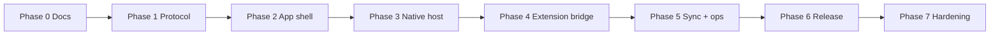

# FSU Companion Roadmap

> Not a version promise. Work is gated by exit criteria and security review.
>
> Embedded beta 的下一階段執行切片見
> [COMPANION_HARDENING_PLAN.md](COMPANION_HARDENING_PLAN.md)。

## Phase overview

| Phase | Status | Deliverable |
|-------|--------|-------------|
| 0 | **Complete** | Architecture + roadmap docs |
| 1 | **Complete** | Shared protocol package + tests |
| 2 | **Complete** | Tauri shell, offline UI, local settings, diagnostics |
| E0–E2 | **Complete (opt-in beta)** | Embedded FUT window, navigation policy, packaged injection, capability split |
| E3–E4 | **Complete (opt-in beta)** | Settings flags, in-webview toolbar, main-window nav, diagnostics lifecycle fields, hide-on-close |
| E5 | Partial | Capability/injection unit tests; manual checklist; CI packages runtime |
| 3 | Planned | Native Messaging host binary |
| 4 | Planned | Extension NM client + companion live status |
| 5 | Planned | Settings sync, richer diagnostics, update check |
| 6 | Planned | Signed macOS/Windows release pipeline |
| 7 | Planned | Chaos/security hardening, protocol v2 if needed |

## Phase 0 — Documentation

**Exit criteria**

- [x] `COMPANION_ARCHITECTURE.md` defines boundaries, forbidden data, offline behavior
- [x] This roadmap lists phases and exit criteria
- [x] Native Messaging is not described as current functionality

## Phase 1 — Shared protocol

**Exit criteria**

- [x] `shared/protocol` with types, validation, errors, fixtures, tests
- [x] All first-wave message types defined
- [x] Fail closed on unknown type/version/keys/oversized/pollution
- [x] No broad `any` / `@ts-ignore` in protocol package

## Phase 2 — Companion app shell

**Exit criteria**

- [x] Tauri 2 + Vite + TypeScript app under `companion/`
- [x] Views: Overview, Extension, Settings, Diagnostics, About
- [x] Explicit Extension disconnected / offline UI
- [x] Local settings allowlist + reset + atomic update
- [x] Open FUT Web App in system browser
- [x] Dock/taskbar app plus system tray/menu bar entry
- [x] Sanitized diagnostics export (no secrets / home path / env dump)
- [x] Light/dark system support; operational density, not marketing layout
- [x] Companion tests/build pass locally; macOS/Windows CI build workflow added

## Phase 3 — Native Messaging host

**Exit criteria**

- [ ] Host binary registered for Chrome (and Edge path documented)
- [ ] Host only accepts messages matching `shared/protocol`
- [ ] Host never logs or persists session material
- [ ] Manual connect smoke on macOS and Windows
- [ ] Security review notes for host install paths

## Phase 4 — Extension bridge

**Exit criteria**

- [ ] Extension `nativeMessaging` permission only if host is product-ready (or behind documented flag)
- [ ] Extension ↔ Companion `hello` / `get_status` live path
- [ ] Disconnected vs connected states proven in tests + manual checklist
- [ ] Existing Extension security tests still pass; no policy relaxation

## Phase 5 — Sync and operations

**Exit criteria**

- [ ] Safe settings sync via allowlisted keys only
- [ ] Diagnostics include extension build version when connected
- [ ] `check_update` uses signed channel or explicit not-configured result
- [ ] Failure isolation: Companion down does not break FUT injection

## Phase 6 — Release

**Exit criteria**

- [ ] macOS signed + notarized artifact
- [ ] Windows signed installer
- [ ] Release notes separate Companion vs Extension versions
- [ ] Protocol compatibility matrix published

## Phase 7 — Hardening

See `COMPANION_HARDENING_PLAN.md` slices H1–H8.

| Slice | Status |
|-------|--------|
| H1 generation + handshake watchdog | **Done** (transition table; late Ready/Failed ignored; 5s timeout → `RUNTIME_HANDSHAKE_TIMEOUT`) |
| H2 ACL exact-set inventory | **Done** (`npm run check:acl` + Rust capability tests) |
| H3 shared request-policy corpus | **Done** (corpus + `productionEndpoints` drift; timeout/network/provider codes; public backoff) |
| H4 macOS custom data-store | **Fallback retained** (non-persistent; gate not passed) |
| H5 lifecycle UX + recovery | **Done** (failed → Reload / browser fallback) |
| H6 CI artifact gates | **Partial** (pure-function fixtures; macOS exact-version/codesign verify fail-closed; Windows install/uninstall wired, awaiting green CI evidence); live WebView + EA matrix + upgrade manual |
| H7 signed beta / update | **Skeleton only** (`0.2.0-beta.1` + release notes) — blocked by signing secrets |
| H8 Native Messaging | **Not started** (separate program) |

**Exit criteria**

- [x] Redaction audit of diagnostics export (sanitized codes/hosts only)
- [x] No open localhost listeners; no generic proxies
- [x] ACL inventory fails CI when commands drift
- [ ] Fuzz or property tests on protocol parser
- [ ] Rollback plan for protocol major bump
- [ ] macOS ARM + Windows 11 real EA manual matrix completed
- [ ] Signed/notarized release (external credentials)

## Non-goals until Phase 3+

- Live Extension connection
- Persisting, logging, or exporting EA cookies or `X-UT-SID`
- Generic Companion-origin remote APIs outside the fixed Embedded HTTP allowlist
