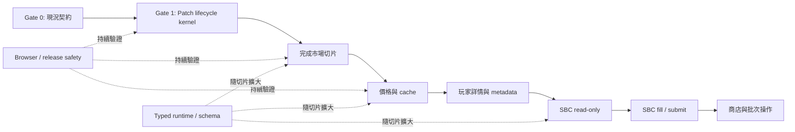

# Refactoring Execution Plan

> 最後更新：2026-07-18

這份文件描述 FSU 的重構執行順序。它不是版本承諾，也不要求先完成整個資料夾或水平架構層；工作以可獨立測試、部署、停用和回滾的垂直功能切片為單位。

## 成功條件

重構完成不是以搬移行數或 TypeScript 百分比判定，而是同時滿足：

1. EA 內部 API 只透過明確 capability boundary 進入功能邏輯。
2. 每個 prototype patch 都可驗證、冪等、隔離失敗並恢復原方法。
3. 遠端資料與共享 runtime state 有具名契約，不會半更新全域狀態。
4. 單一功能失效時，其餘功能與 extension 啟動流程仍可使用。
5. CI 能在真實 MV3 runtime 驗證 extension handshake 與安全邊界。

## 執行原則

1. 保持使用者功能、設定 key 和資料格式相容；不相容變更必須有遷移與回滾說明。
2. 先補 characterization test，再改依賴方向；機械式搬移和行為改變分開提交。
3. EA runtime、page world、extension bridge 和遠端資料是四個不同信任邊界。
4. `legacy/` 只減少，不新增業務邏輯。
5. 新功能不得增加未封裝的 `UT*`、`services`、`repositories` 或 `events.*` 依賴。
6. 一次只維持一個主要功能切片在進行中；共用基礎設施只做到能支援下一個切片。
7. Browser、security、typecheck 和 release safety 是持續軌，不延後到重構尾聲。

## 狀態定義

| 狀態 | 意義 |
|------|------|
| `完成` | exit criteria 有自動化證據，文件與產物同步 |
| `進行中` | 已有可用切片，但仍有列出的缺口 |
| `下一步` | 已排入下一批 PR，前置條件明確 |
| `待排程` | 方向已決定，尚未進入主要工作佇列 |
| `阻塞` | 缺少外部資訊、EA fixture 或必要決策 |

## 現況基線

### 已具備

- Manifest V3 extension、packaged dependencies 與 esbuild bundle
- `FsuContext`、`ModuleRegistry`、`PatchInstaller` 和第一批 domain services
- background request policy、受限 page injection 與 HTML safety helper
- `EaRuntimeAdapter`、`EaMarketSearchSession` 和市場 capability diagnostics
- ESLint、CodeQL、單元測試、strict `checkJs` island
- EA bundle prototype compatibility checker

### 已知缺口

- 多數 patch 仍為直接 prototype assignment；lifecycle descriptor 已覆蓋 pilot
  與 PR21 的 `rewards.choice-set-render` / `item.plus-playstyles-normalize` 等。
  精確數量見 `MIGRATION_INVENTORY.md`（以可重現掃描為準，勿手抄）。
- `PatchRegistry` 仍保存 legacy 原方法；`PatchLifecycleRegistry` 已提供 descriptor、verify、idempotence、restore 與 sanitized diagnostics。
- `events.*` 仍同時是 facade、service locator 和可變註冊表；`info` 仍是寬鬆共享狀態。
- 部分 `domain/` 模組仍直接使用 `UT*`、Lodash `_`、`services` 或 `repositories`，不能視為純 domain。
- strict `checkJs` island 檔案數以 `extension/tsconfig.json` 的 `files` 為準（目前 33）。
- MV3 browser smoke 已載入 unpacked extension，覆蓋 handshake、forgery rejection、
  reload invalidation，以及 sanitized EA shell 中 production descriptor 的
  install/disable/reinstall/restore。
- Domain、patch phase 與 EA capability 現況已記錄於 `MIGRATION_INVENTORY.md`；後續 PR 必須同步更新。
- 下一階段優化（cleanup / HTML / owners / remote schema / release gates）見
  [NEXT_OPTIMIZATION_PLAN.md](NEXT_OPTIMIZATION_PLAN.md)（PR19–PR23 已完成）。

以下數字只用來觀察趨勢，不是完成 KPI。更新基線時使用可重現命令，並在 PR 描述記錄差異：

```bash
find extension/src/fsu/patches -type f -name '*.js' | wc -l
rg -n '\.prototype\.[A-Za-z0-9_$]+\s*=' extension/src/fsu | wc -l
rg -n 'events\.[A-Za-z0-9_$]+\s*=' extension/src/fsu | wc -l
rg -o '\binfo\.[A-Za-z0-9_$]+' extension/src/fsu | wc -l
```

## 關鍵路徑



原有 6 個 `PatchInstaller` phase 在遷移期間保持順序不變。新 lifecycle kernel 是相容層，不是一次改寫全部 patch 的理由。

## Gate 0：現況契約

**狀態**：`完成`

**目標**：先讓文件、inventory 和實作說同一件事，避免用理想架構判定進度。

交付項目：

- 修正 `ARCHITECTURE.md` 中不存在或已移除的模組/API。
- 在 `MIGRATION_INVENTORY.md` 將 `domain/` 模組標記為 `pure`、`EA-boundary` 或 `legacy-domain`。
- 建立 patch inventory：feature、phase、target、原方法來源、依賴、風險、測試狀態。
- 建立 EA capability inventory：consumer、runtime member、failure result、fixture。
- 在 `.github/pull_request_template.md` 加入 capability、fallback、驗證證據欄位。

完成條件：

- 文件不再把未完成 adapter 或不存在模組描述成現況。
- 每個直接 prototype assignment 都能對應 feature 與 installer phase。
- 下一個切片需要的 EA members 已有 inventory，不靠開工後臨時搜尋。
- `README`、`SECURITY`、`ARCHITECTURE`、`AGENTS` 的命令和安全規則一致。

## Gate 1：Patch Lifecycle Kernel

**狀態**：`完成`

**目標**：提供最小但完整的 patch 安裝原語，先遷移一個低風險 patch 驗證設計。

已實作 descriptor：

```js
registry.install({
  id: "home.academy-tile",
  phase: "pre-installer-bootstrap",
  resolveTarget,
  verify,
  apply
});
```

原 property descriptor 由 registry 自動恢復；只有 patch 另有副作用時才提供
optional `restore` hook。

必要語意：

- `id` 全域唯一；重複安裝回傳 `already-installed`，不得形成雙重 wrapper。
- `resolveTarget` 找不到 EA member 時回傳 `unsupported`，不得拋出未處理的 `ReferenceError`。
- `verify` 在修改 prototype 前檢查 target shape 與必要 signature。
- `apply` 只在 verify 成功後執行，並保存精確原始 property descriptor。
- `restore` 恢復原 descriptor；部分安裝失敗不得留下半套狀態。
- diagnostics 只含 feature、capability、phase 和缺少 member，不得含 FUT session 或個人資料。
- 單一 patch 失敗不得中止無關 feature；同 feature 的相依 patch 可 fail closed。

完成條件：

- 測試覆蓋 install、duplicate、unsupported、verify failure、apply failure、restore 和 phase order。
- 一個低風險 patch 完成 descriptor 遷移與 characterization test。
- 現有 `PatchInstaller.installAll()` 順序與使用者行為不變。
- lifecycle API 有 JSDoc contract 並納入 strict `checkJs`。

## 垂直切片

每個切片都使用同一個完成定義，不再另開一個「全面 typed runtime」水平 phase。型別、schema、store 和 adapter 只擴大到當前功能真正需要的範圍。

### Slice 1：完成市場流程

**狀態**：`完成`

已完成：

- UTAS session refresh、market cache、transfer market search、EA query model、價格步進
- 移動物品到俱樂部、購買後入隊、物品上架、未分配清單重置
- 靜態物品資料、購買容量與上架庫存查詢
- capability unavailable diagnostics 與 adapter 單元測試
- `MarketActionService` 已移除直接 Lodash、EA UI constructor、`MAX_NEW_ITEMS`、
  `services` 與 `repositories` 依賴
- auction/search/purchase/listing runtime result contract、malformed fixtures 與
  auction price renderer boundary
- `market.search-view-generate` lifecycle descriptor、精確 restore、
  `setMarketSearchGenerateEnabled` runtime toggle 與 unsupported/mismatch fixtures

剩餘工作：

- 盤點並遷移剩餘市場寫入路徑，不以「市場大致可用」代替 capability 清單。
- 逐一將其餘市場 patch family 遷移到 lifecycle descriptor，不把 pilot 描述成全面完成。
- 補市場 read-only、purchase、move、listing 的 characterization/golden tests。

完成條件：

- `MarketActionService` 不直接引用 `UT*`、`_`、`services` 或 `repositories`。
- 每個市場 capability 都有 success、unsupported 與 EA failure 測試。
- 任一市場 capability 缺失只停用受影響動作，頁面與其他功能仍可啟動。
- 已遷移的市場 patch 可重複安裝與 restore，且 diagnostics 可指出缺少的 EA member。

### Slice 2：價格顯示與 Cache

**狀態**：`完成`

範圍：

- `PriceService`、request queue、TTL cache、價格 response schema
- 價格 UI renderer 與相關 patch descriptor
- stale cache、partial provider failure、rate limit 與 malformed response 行為

已完成：

- FUT.GG、FUTNext、Futbin response 先通過 strict runtime schema，再整批更新 cache。
- 5 分鐘 freshness TTL 與 24 小時 stale fallback；provider failure 不刪除舊值。
- request queue 保留同批 in-flight deduplication。
- squad value 更新抽至 `PriceRenderer`，並由 `price.squad-value` descriptor 管理。
- normal、empty、partial malformed、timeout、stale、install/disable/restore fixtures。

完成條件：

- 遠端 response 驗證後才更新 cache。
- provider 失敗不清除最後一筆有效資料，也不留下半更新 `info`。
- domain 不透過任意 `events.*` 查找 HTTP、cache 或 UI 依賴。
- fixture 覆蓋正常、空資料、malformed、timeout 和 stale fallback。

### Slice 3：玩家詳情與 Metadata

**狀態**：`完成`

範圍：

- 玩家靜態資料、PlayerMeta、GGR/FG/進化資料 capability
- 詳情按鈕與 renderer boundary
- 遠端 metadata schema、快取與 feature isolation

已完成：

- `meta`、`ggrating`、`evolutions`、`playermeta` 使用獨立 strict schema 與 atomic commit。
- malformed provider 只保留該 provider 最後有效 state，不阻止其他 endpoint 套用。
- EA player item 與 desktop/mobile controller shape 由 `PlayerDetailsRenderer` 驗證。
- `details.quick-list-render` descriptor 保留 EA render-first 順序並提供 runtime toggle。
- provider malformed、desktop/mobile、install/disable/restore、unsupported/mismatch fixtures。

完成條件：

- EA item shape 與遠端 metadata 分別驗證。
- 缺少單一 metadata provider 時仍可顯示其餘詳情。
- 詳情 patch 使用 lifecycle descriptor，desktop/mobile fixture 都有測試。

### Slice 4：SBC Read-only

**狀態**：`完成`

範圍：

- requirements、set/challenge、squad snapshot、chemistry inputs
- SBC repository/service/localization adapters
- `SbcDataService` 等模組中的直接 EA constructor 隔離

已完成：

- `SbcReadAdapter` 封裝 requirement getter、set repository 與 localization utility，
  capability 缺失時回傳具名 fail-closed result。
- `SbcRequirementsService` 不再直接讀取 `_`、`UTLocalizationUtil` 或 `services`，
  並納入 strict island。
- `sbc.challenges-view` descriptor 保留 EA-first 與原 installer phase，提供
  install/disable/restore/unsupported 測試。
- malformed requirement 與缺少 set repository 時略過增強 control，不修改 SBC state。
- Futbin top-list/squad 與 FUT.GG squad response 使用 strict schema；任一 player
  畸形時整批拒絕。
- Futbin ID 與 price cache 經單一 `commitFutbinSquadPlayers()` 提交，malformed
  response 不會留下部分 mapping 或 price。
- `SbcSquadSnapshotAdapter` 將 EA controller/slot 轉為 chemistry snapshot；
  `SbcChemistryService` 不再直接走訪 controller shape。

`createVirtualChallenge`、`saveOldSquad` 與 `getRatingPlayers` 會建構 entity、
維護 undo state 或支援填隊，歸入 Slice 5，不視為 read-only 遺留。

完成條件：

- requirements 與 squad read-only 流程不直接讀取 `services`、`repositories` 或 `UT*`。
- malformed remote SBC response 不會修改既有 state。
- fixture/golden tests 覆蓋至少一個 set、challenge、squad 和缺少 capability 情境。

### Slice 5：SBC Fill / Submit

**狀態**：`完成`

前置條件：SBC read-only 完成，且 browser smoke 能驗證 feature disable。

範圍：

- fill planner、player move、challenge submit、成功後 cache/state refresh
- 寫入前 precondition、可取消流程、重複提交保護
- 高風險操作的 feature flag 與明確 diagnostics

已完成：

- `sbc.virtual-challenge` capability 驗證所有 EA constructors/services 後才建立
  simulation entity；缺少 capability 時 template/player-match 安全退出。
- `SbcUndoHistoryService` 使用 frozen snapshot 與 copy-on-write slot replacement，
  不再原地修改既有 undo step。
- template workflow 使用 service-owned `CancellableOperation`；新工作使舊 token
  失效，loader close 透過顯式 API 取消，不再共享 `info.run.template` flag。
- `EaObservableAdapter` 將 save/load callback 轉為會 `unobserve` 的 bounded promise，
  timeout 與 capability failure 使用具名 result。
- `SbcSquadSaveService` 依 challenge 去重；save 或 reload 失敗會恢復原 players，
  只有完整成功才提交 loaded squad、undo 與 template state。
- 不同 challenge 同時保存時以 active transaction count 協調 shared saving/loader，
  單一 transaction 完成不會提早清掉另一筆狀態。
- `SbcSubmitTransactionService` 驗證 challenge/set/canSubmit，攔截同 challenge
  重複提交；第二次呼叫回傳 `SBC_SUBMIT_IN_FLIGHT`，不共用成功 callback。
- submit observer 使用 bounded one-shot adapter；確實收到 EA response 才釋放
  in-flight lock，timeout/observe failure 保持 fail-closed 到 runtime 重載。
- completion response 與 set ID 經 schema 驗證後才更新 count、再次挑戰 state
  與 header；set refresh 共用單一 bounded request，partial failure 只記錄診斷。
- `sbc.submit-transaction` lifecycle descriptor 保留 `installLate` 順序，覆蓋
  install、duplicate、unsupported、success、timeout 與 restore。

完成條件：

- submit 前驗證 challenge、squad 與 capability；失敗時不進行部分寫入。
- 重複事件或 patch 安裝不會重複提交。
- EA rejection、timeout、partial move 與 extension invalidation 都有測試或可重現 fixture。

### Slice 6：商店、批次操作與其他自動化

**狀態**：`完成`

前置條件：前述切片的 lifecycle、diagnostics、feature flag 和 browser test 模式已穩定。

執行順序：

1. `完成`：先建立 sanitized EA shell，讓 descriptor install/disable/restore 能在 MV3
   browser runtime 驗證，不只依賴 Node fixture。
2. `完成`：抽出 pack catalog/read model 與 schema，再遷移 `UTStoreView.setPacks`；
   malformed article 只略過增強資訊，不阻止 EA 原始商店畫面。
3. `完成`：隔離 pack open intent 與「再次開包」state commit；只有 validated
   selection 與 inventory-confirmed completion 能更新 state，重複事件與 timeout
   fail closed。
4. `完成`：將 in-packs concept pagination 改為可取消、bounded page/timeout、逐頁 result；
   navigation 離開或新查詢會取消舊工作。
5. `完成`：最後遷移 store hub/category/reveal UI patch family，逐個 descriptor 停用與
   restore；pack animation timing hook 也歸入此 UI family，不以單一 store
   feature flag 隱藏部分失敗。

完成條件：

- 每個批次操作可取消、有速率限制、逐項結果與失敗隔離。
- 不共享不可追蹤的 `info.run.*` mutable flag。
- 商店與批次 patch 可獨立停用，不影響一般 FUT 導航。
- pack catalog、open 與 concept search 各有 success、malformed、unsupported、
  timeout/duplicate fixture。
- `完成`：sanitized EA shell 已覆蓋 `store.pack-list` 與
  `store.pack-animation` 的 install/disable/reinstall/restore。

## 持續軌

### Typed Runtime 與資料契約

每個垂直切片必須同步：

- 為 adapter input/output、remote response 和 store state 定義 JSDoc contract。
- 對不可信 JSON 使用 runtime validation；TypeScript type 不能代替驗證。
- 將當前切片的純 `core/`、`infra/`、`domain/` 檔案加入 strict island。
- 優先使用具名 result；只有程式錯誤或不可恢復 invariant 才拋 Error。
- 不為追求覆蓋率一次把所有 `events/info` 搬入新 store。

### Browser Integration 與 Release Safety

按以下順序逐步建立，不等待所有功能遷移：

1. `完成`：載入 unpacked extension，驗證 background/content/page handshake。
2. `完成`：驗證 forged page message、request rejection 與 extension reload invalidation。
3. `完成`：加入 sanitized EA shell，驗證第一個 descriptor patch 的 install/disable/restore。
4. 每完成一個垂直切片，加入一條主要成功流程和一條 capability failure 流程。
5. release gate 加入 bundle drift、package smoke、browser checks 與 rollback checklist。

完成條件：

- CI 使用 Playwright persistent context 載入 extension。
- `npm run build` 後執行 `git diff --exit-code -- src/userscript.js`，阻止 bundle drift。
- browser failure artifact 不含 Cookie、session、`X-UT-SID` 或帳號資料。
- release 前 lint、typecheck、unit、security、browser 和 package checks 全部通過。

## 已完成 PR 序列

依序執行；除非前一項阻塞，不平行展開多個主要切片。

| PR | 狀態 | 範圍 | 可驗收輸出 |
|----|------|------|------------|
| 1 | `完成` | 現況文件與 inventory | 修正 stale architecture；patch/capability inventory 可追蹤 |
| 2 | `完成` | Patch lifecycle kernel | descriptor API、diagnostics、完整 lifecycle unit tests |
| 3 | `完成` | 低風險 pilot patch | `home.academy-tile` descriptor、characterization、disable/restore |
| 4 | `完成` | MV3 browser smoke | handshake、forgery rejection、reload invalidation |
| 5 | `完成` | 市場 domain/UI boundary | `MarketActionService` 移除 `UT*`/`_`，補 result schema |
| 6 | `完成` | 市場 lifecycle pilot | `market.search-view-generate` descriptor、feature disable、success/failure fixtures |
| 7 | `完成` | 價格與 cache 切片 | schema、stale fallback、renderer、descriptor、tests |
| 8 | `完成` | 玩家詳情與 metadata | provider schema、renderer boundary、feature isolation |
| 9 | `完成` | SBC read-only pilot | requirements/localization/set adapter、challenge descriptor、malformed isolation |
| 10 | `完成` | SBC snapshot boundary | squad schema、chemistry snapshot、atomic Futbin cache commit |
| 11 | `完成` | SBC fill preconditions | virtual challenge capability、immutable undo、template cancellation |
| 12 | `完成` | SBC save transaction | observable result、timeout、dedupe、rollback isolation |
| 13 | `完成` | SBC submit transaction | precondition、duplicate-submit guard、completion refresh |
| 14 | `完成` | Sanitized EA browser shell | MV3 內 descriptor install/disable/restore、無敏感 artifact |
| 15 | `完成` | Store pack catalog boundary | article schema、read model、`store.pack-list` descriptor |
| 16 | `完成` | Pack open state transaction | precondition、duplicate/timeout guard、validated state commit |
| 17 | `完成` | In-packs paginated search | cancellation、bounded pages、rate limit、partial failure result |
| 18 | `完成` | Store UI lifecycle family | hub/category/reveal/animation descriptors、feature isolation、exact restore |

PR 1 可以和 lifecycle API 設計討論並行，但 PR 2 合併前必須完成 inventory，以免 descriptor ID、phase 或 restore target 建在錯誤假設上。

## 每個 PR 的 Definition of Done

- 範圍只包含一個 capability、patch family 或必要的共用原語。
- PR 描述包含目前行為、目標行為、EA members、fallback、風險和回滾方式。
- 行為修改前已有 characterization test；新 result/schema 有 malformed 與 unavailable 測試。
- 新依賴透過 `FsuContext.pick()`、adapter 或具名 helper 傳入。
- patch 有唯一 ID、phase、verify、idempotence、diagnostics 和 restore 策略。
- 遠端資料通過 schema/HTML boundary；未新增任意 URL/method/header proxy。
- strict island 隨本切片擴大，沒有廣泛 `any` 或 `@ts-ignore`。
- `npm run lint`、`npm run test:ci`、`npm run package` 通過。
- 修改 EA patch 時執行 bundle compatibility check；沒有本機 bundle時在 PR 明確記錄限制。
- `src/userscript.js` 只由 build 產生，文件、測試和 bundle 與行為同步。

## 非目標

- 不改寫成 Rust/WASM。
- 不為了框架一致性在 EA DOM 上引入大型 UI framework。
- 不承諾消除所有 prototype patch；EA 沒有公開 extension API，必要 hook 仍會存在。
- 不在同一個 PR 重寫全部 SBC、市場或商店流程。
- 不用行數、檔案數或 TypeScript 百分比取代使用者行為與 failure isolation 的驗收。
